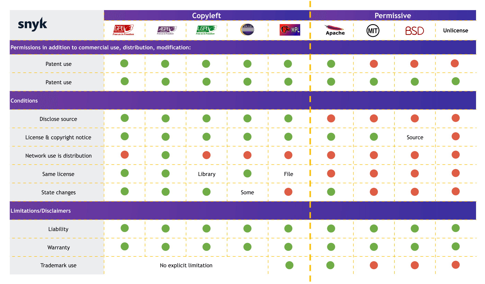

# OSI Model:Layers, functions, and interaction methods.

## OSI(Open System Interconnection Reference Model)

<figure><figcaption>
<a href="https://aws.amazon.com/ko/what-is/osi-model/">https://aws.amazon.com/ko/what-is/osi-model/</a>
</figcaption></figure>

#### 1. 물리 계층

비트가 물리적 매체를 통해 전송되는 곳

케이블, 안테나, 허브, 리피터 등

#### 2. 데이터 링크 계층

Point to Point 간 신뢰성있는 전송 보장(에러 검출, 재전송, 흐름제어)

주소값은 맥 주소로 받음

이더넷, HDLC, ADCCP

네트워크 브릿지나 스위치

#### 3. 네트워크 계층

패킷이 노드를 거칠 때 경로를 찾아줌 서비스 품질(QoS) 제공

라우팅, 흐름 제어, 세그멘테이션 오류, 인터네트워킹 제공

주소부여(IP)

경로 설정 (Route)

#### 4. 전송 계층

End to end 사용자들의 신뢰성 있는 데이터를 받을 수 있게 해 줌

오류검출, 복구와 흐름제어, 중복검사

#### 5. 세션 계층

프로세스가 통신을 관리하기 위한 방법 제공

(추상적인 개념으로 접근 통신 세션을 관리)

통신을 하기 위한 세션을 확림/유지/중단 (OS)

#### 6. 표현 계층

코드간의 번역 담당 데이터 형식 차이 부담 덜어줌

인코딩 등

사용자의 명령어를 완성 및 결과 표현

포장/압축/암호화

#### 7. 응용 계층

프로세스와 직접 관계하여 일반적인 응용 서비스를 수행

가상 터미널(telnet), JTM등

소프트웨어UI, I/O
